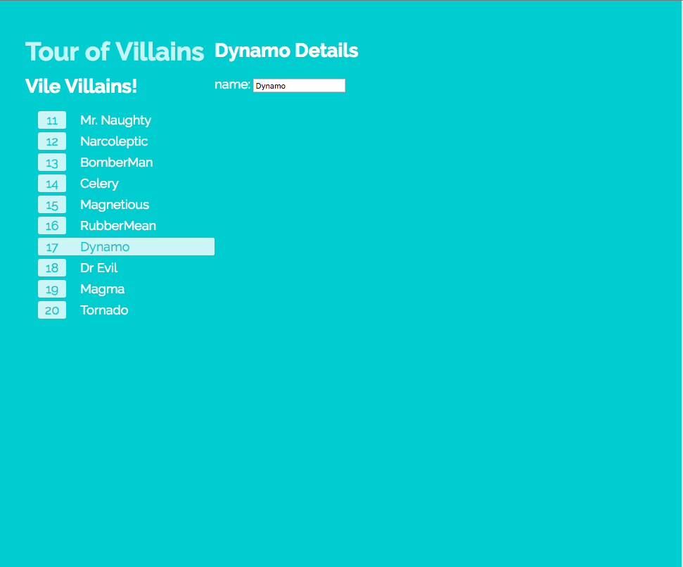

# Cautious Chainsaw - Tour of Villains!

Just following allong with [angular.io](https://angular.io)'s Quick Start & Tutorial in my own way.

# How to Run

Requires `node` and `npm`. Install those and run:  

```sh
npm install
npm start
```
# Status 

* Now Completed till Chapter 5 - Services - 27th May 2016

